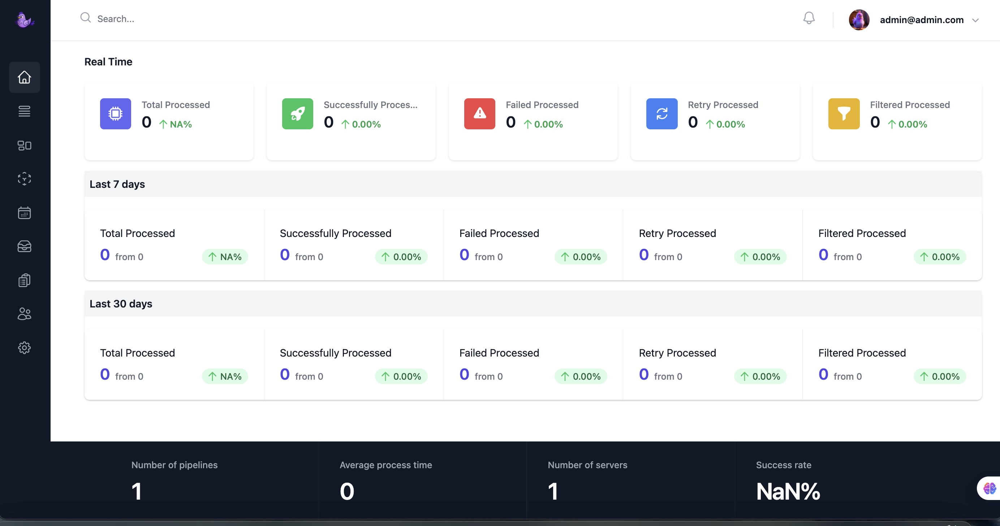
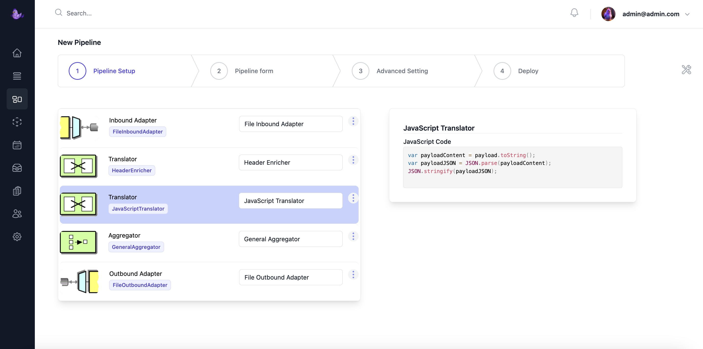
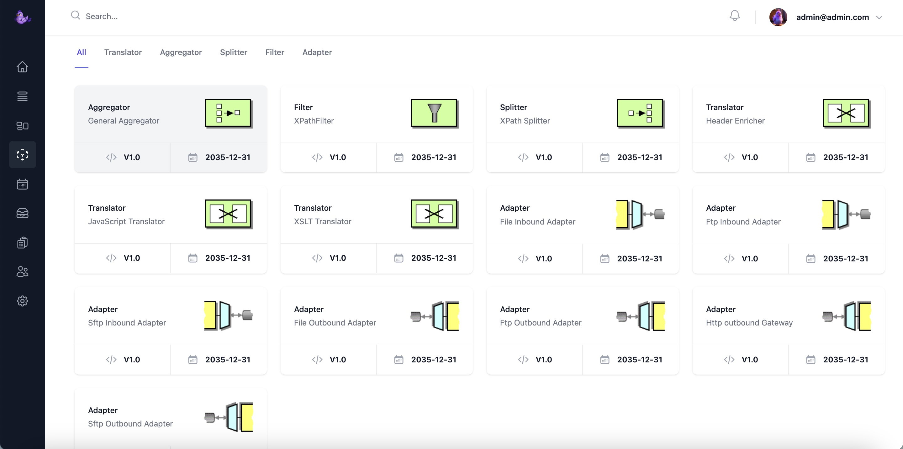

# Docking -- Next Generation Enterprise Application Integration (EAI)  

Docking focuses on seamless connectivity, leveraging cloud services, APIs, and microservices to enhance agility, scalability, and data-driven integration across organizations.  

For more information, please visit [https://dockling.me](https://dockling.me).  

## Try  

You can try the Docking application by downloading the [docker-compose.yml](./docker-compose.yml) file.  

- **URL:** [http://localhost](http://localhost)  
- **Login User:** admin@admin.com  
- **Login Password:** 111111a  

## Docking is a plugin-based application  
- **Plugin information:** [https://www.dockling.me/#features-section](https://www.dockling.me/#features-section)  
- **Plugin Hub:** [https://hub.dockling.me](https://hub.dockling.me)  

## Docking Page Overview  
### Dashboard Page  
  

### Pipeline Page  
  

### Adapters/Plugin Page  
  
